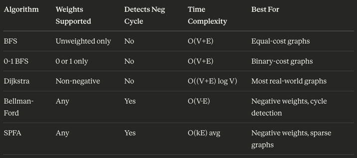

Single-Source Shortest Path — When to Use What
The core question when choosing an algorithm is: what do you know about your graph? Here's a deep breakdown.

1. BFS — Breadth-First Search
Use when: All edges have equal/no weight (unweighted graph).
BFS naturally explores nodes in order of hop count (number of edges), which is equivalent to "distance" when all edges cost the same. There's no need for a priority queue — a simple FIFO queue suffices.
Ideal scenarios:

Social network distance ("how many connections between A and B?")
Maze solving where each step costs the same
Network routing in unweighted topologies
Word ladder problems (each transformation = 1 step)

Avoid when: Edges have different weights. BFS will give wrong answers because it doesn't account for cost — it only counts hops.

2. 0-1 BFS
Use when: Edge weights are strictly either 0 or 1.
This is a clever middle ground between BFS and Dijkstra. Instead of a priority queue, it uses a deque (double-ended queue). Edges with weight 0 push to the front (free moves), edges with weight 1 push to the back. This keeps the deque sorted without any heap overhead.
Ideal scenarios:

Grid problems where you can move freely in some directions but pay a cost in others
"Minimum number of changes/flips" problems in competitive programming
Graphs where some connections are "free shortcuts"

Avoid when: Weights go beyond 0 and 1. The deque trick breaks down.

3. Dijkstra's Algorithm
Use when: Edges have non-negative weights and you need the most reliable, well-understood solution.
Dijkstra is the workhorse of shortest path algorithms. It works by greedily locking in the shortest distance to the nearest unvisited node, then relaxing its neighbors. The key insight is: once a node is settled, its shortest distance is final — this only holds because no negative edge can later offer a shorter path.
Ideal scenarios:

Road/map navigation (distances are always positive)
Network packet routing (latency, bandwidth cost)
Game pathfinding on weighted grids
Any weighted graph where you're confident no edge is negative

Implementation variants affect performance:

Binary heap → O((V + E) log V) — standard, good general choice
Fibonacci heap → O(E + V log V) — theoretically better for dense graphs, rarely used in practice due to implementation complexity
Simple array → O(V²) — actually better than heap when the graph is very dense (E ≈ V²), since heap operations become expensive

Avoid when: There are negative edge weights. Dijkstra can silently produce wrong answers — it won't crash or warn you, making bugs hard to catch.

4. Bellman-Ford Algorithm
Use when: The graph may contain negative edge weights.
Bellman-Ford relaxes all edges V−1 times. The reasoning: any shortest path in a graph with V nodes can have at most V−1 edges (assuming no negative cycles). So after V−1 rounds of relaxation, all shortest distances are guaranteed to be correct.
Bonus capability: Run one more (V-th) round of relaxation. If any distance still changes, a negative cycle exists and is reachable from the source. This is something Dijkstra cannot detect at all.
Ideal scenarios:

Financial graphs where edges represent gains/losses (arbitrage detection)
Network routing protocols like RIP (Routing Information Protocol), which is literally based on Bellman-Ford
Any graph where edge weights can be negative but you still need correctness
Detecting negative cycles as part of the algorithm's output

Tradeoffs:

O(V · E) is significantly slower than Dijkstra
For large graphs with no negative weights, Dijkstra is always the better choice
Bellman-Ford is simple to implement and very robust

Avoid when: The graph has a negative cycle reachable from the source — shortest paths become undefined (you can loop forever to reduce cost infinitely).

5. SPFA — Shortest Path Faster Algorithm
Use when: You have negative weights but expect the graph to be sparse or "well-behaved" in practice.
SPFA is an optimization of Bellman-Ford. Instead of blindly relaxing all edges every round, it maintains a queue of only nodes whose distances recently changed. Unchanged nodes are skipped entirely. In practice this is much faster — average case is roughly O(kE) where k is small.
Ideal scenarios:

Competitive programming where graphs often have negative edges but aren't adversarial
Sparse graphs with negative weights where Bellman-Ford feels too slow
When you need Bellman-Ford's correctness but want a practical speedup

Critical caveat: SPFA's worst case is still O(V · E). It can be deliberately made slow with adversarial inputs (there are known "SPFA killer" test cases in competitive programming). For this reason, it has fallen out of favor in contests and production systems where reliability matters more than average speed.

Is the graph unweighted (all edges equal)?
    └── YES → BFS  O(V+E)

Are all weights 0 or 1?
    └── YES → 0-1 BFS  O(V+E)

Are all weights non-negative?
    └── YES → Dijkstra  O((V+E) log V)
               └── Very dense graph (E ≈ V²)? → Dijkstra with array  O(V²)

Can weights be negative?
    └── Do you need to detect negative cycles, or need guaranteed correctness?
           └── YES → Bellman-Ford  O(VE)
    └── Sparse graph, no adversarial inputs, want speed in practice?
           └── YES → SPFA  O(kE) average, O(VE) worst

